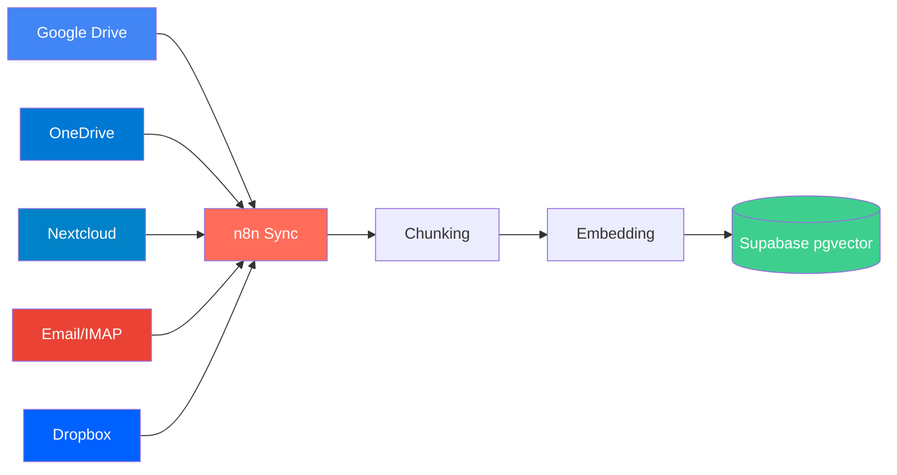
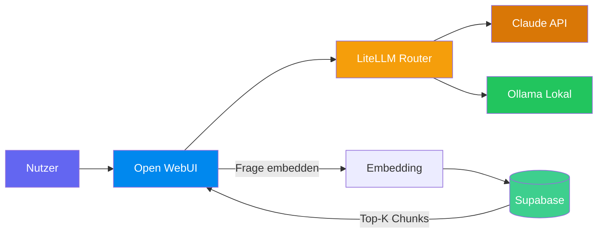
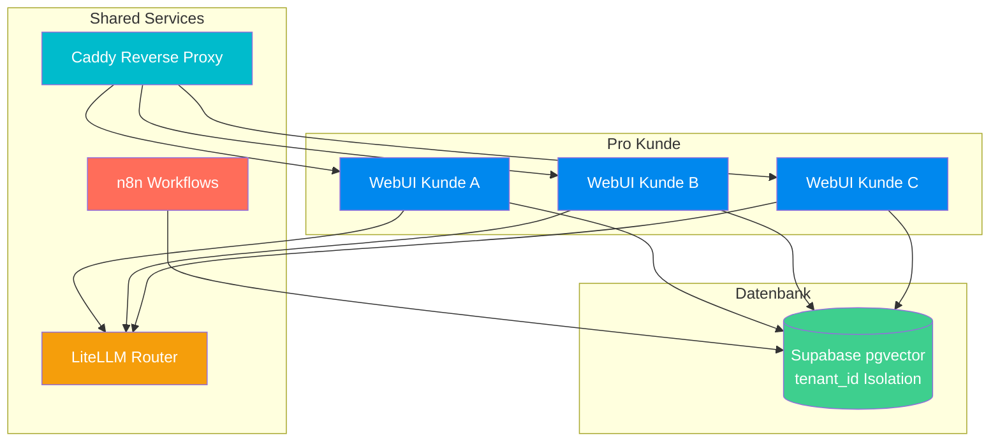
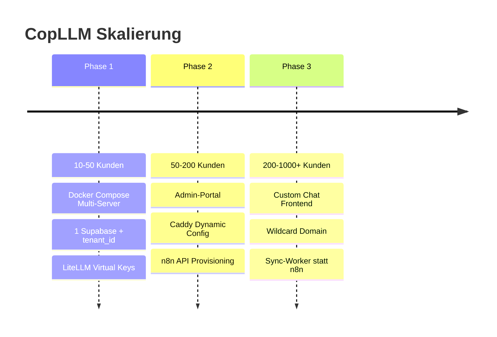

# Architektur

## Datenfluss — Dokument-Sync

## Datenfluss — User-Anfrage (RAG)

## Multi-Kunden Architektur

## Komponenten

| Service | Container | Port | Shared? |
|---------|-----------|------|---------|
| Caddy | copllm-caddy | 80, 443 | Ja |
| LiteLLM | copllm-litellm | 4000 (intern) | Ja |
| n8n | copllm-n8n | 5678 (intern) | Ja |
| Open WebUI | copllm-webui-{kunde} | 8080 (intern) | Nein (pro Kunde) |
| Supabase | extern (Frankfurt) | — | Ja (tenant_id) |

## Skalierungs-Phasen

