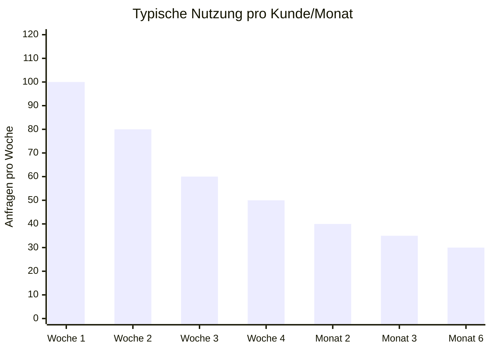
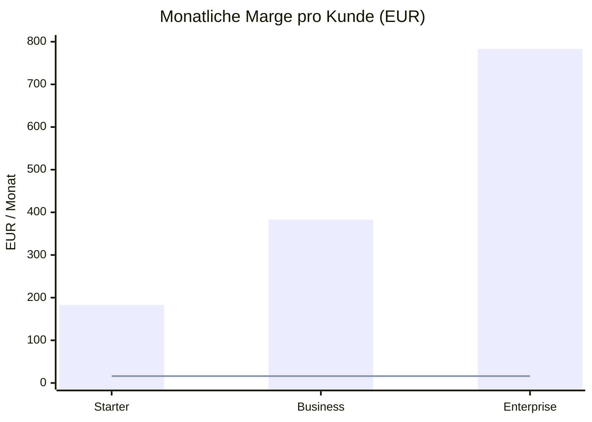
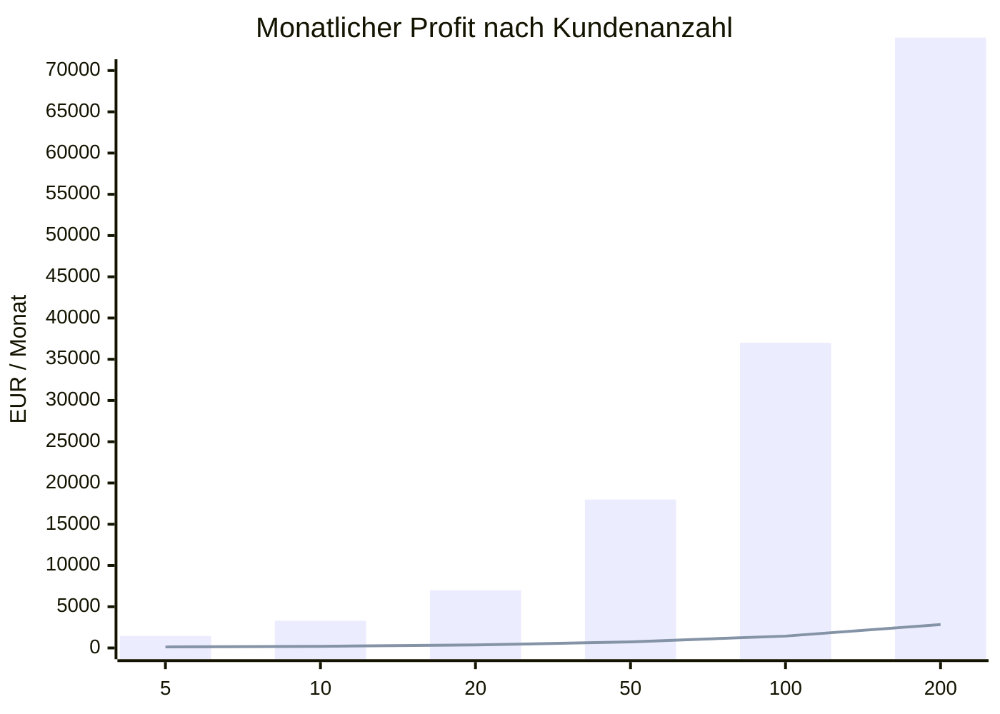
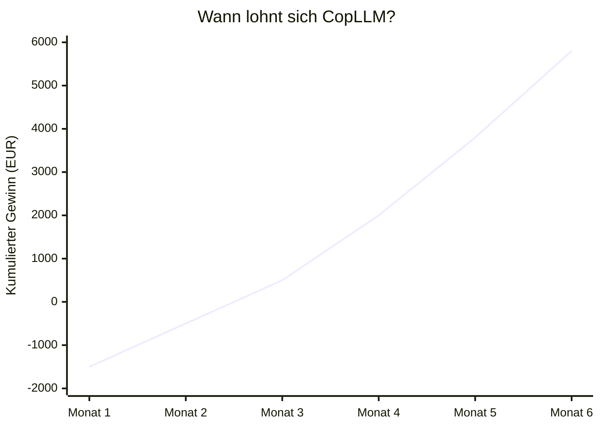
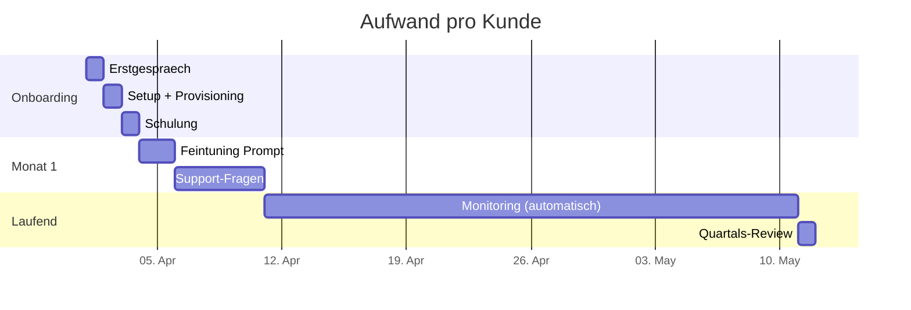
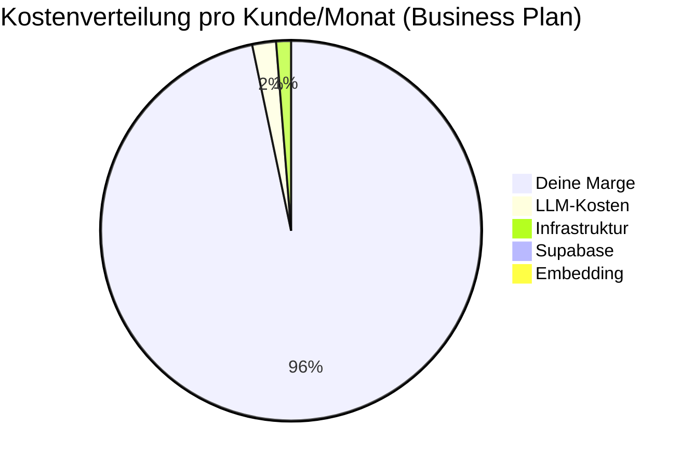

---
tags:
  - business
  - pricing
---

# Business Model & Kalkulation

## Kostenstruktur pro Kunde

### Einmalige Kosten (Setup/Onboarding)

| Posten | Dein Aufwand | Kosten (intern) | Preis an Kunde |
|--------|-------------|-----------------|----------------|
| Erstgespraech + Anforderung | 1h | 0 EUR | inkl. |
| Supabase Schema + Tenant anlegen | 15 Min | 0 EUR | inkl. |
| Open WebUI Container deployen | 10 Min (Script) | 0 EUR | inkl. |
| n8n Workflow einrichten | 30-60 Min | 0 EUR | inkl. |
| Drive/Nextcloud Credentials | 15 Min | 0 EUR | inkl. |
| Initialer Dokument-Import | 30 Min (laeuft automatisch) | 0 EUR | inkl. |
| System-Prompt anpassen | 15 Min | 0 EUR | inkl. |
| Admin-Account + Nutzer anlegen | 10 Min | 0 EUR | inkl. |
| Schulung (Remote) | 60 Min | 0 EUR | inkl. |
| **Gesamt Setup-Zeit** | **~3-4 Stunden** | **0 EUR** | **990-1.990 EUR** |

!!! tip "Automatisierung senkt den Aufwand"
    Mit `provision.py` + n8n API Provisioning (Phase 2) sinkt der Setup-Aufwand auf **~30-60 Min** pro Kunde.

### Laufende Kosten pro Kunde/Monat

| Posten | Berechnung | Kosten/Monat |
|--------|-----------|-------------|
| **LLM-Kosten (Claude)** | ~200 Anfragen × ~1.500 Tokens = 300K Tokens | **~4-8 EUR** |
| **Embedding-Kosten** | ~500 Dokumente × 10 Chunks = einmalig, dann nur neue | **~0,50 EUR** |
| **Infrastruktur-Anteil** | 1 WebUI Container auf shared Server | **~3-5 EUR** |
| **Supabase-Anteil** | 1 Tenant auf shared Instanz (Pro Plan 25 EUR / N Kunden) | **~1-2 EUR** |
| **Monitoring/Wartung** | Anteilig (~15 Min/Monat pro Kunde) | **~0 EUR** |
| **Gesamt variable Kosten** | | **~9-16 EUR** |

## Durchschnittliche Kunden-Nutzung

!!! info "Nutzungsmuster"
    - **Woche 1-2:** Hohe Nutzung (Neugierde, Testen) — ~80-100 Anfragen/Woche
    - **Ab Monat 2:** Einpendelung auf ~30-50 Anfragen/Woche (~150-200/Monat)
    - **Power User:** ~400-500 Anfragen/Monat (Vertrieb, Support-Teams)
    - **Durchschnitt:** ~200 Anfragen/Monat = ~300K Tokens = ~4-8 EUR LLM-Kosten

## Preismodelle

| Plan | Preis/Monat | Setup-Gebuehr | Inklusiv | Zielgruppe |
|------|------------|---------------|----------|------------|
| **Starter** | 199 EUR | 990 EUR | 100K Tokens, 1 Quelle, 5 Nutzer | Kleine Bueros |
| **Business** | 399 EUR | 1.490 EUR | 500K Tokens, 3 Quellen, 20 Nutzer | KMU Standard |
| **Enterprise** | 799 EUR | 2.990 EUR | Unlimitiert, alle Quellen, Custom Prompt | Mittelstand |

## Marge pro Kunde

| Plan | Preis | - Variable Kosten | = **Marge** | **Marge %** |
|------|-------|-------------------|-------------|-------------|
| Starter | 199 EUR | ~16 EUR | **183 EUR** | **92%** |
| Business | 399 EUR | ~16 EUR | **383 EUR** | **96%** |
| Enterprise | 799 EUR | ~16 EUR | **783 EUR** | **98%** |

!!! success "Extrem hohe Margen"
    Die variablen Kosten sind minimal weil LLM-Kosten bei normaler Nutzung nur ~4-8 EUR/Monat betragen und Infrastruktur geteilt wird. Der Hauptaufwand ist einmaliges Setup.

## Skalierungsrechnung

### Infrastruktur-Fixkosten

| Posten | Kosten/Monat | Ab wann noetig |
|--------|-------------|----------------|
| Hetzner CX41 (16GB) — Control | 15 EUR | Ab Kunde 1 |
| Hetzner CX31 (8GB) — Worker | 7 EUR pro Server | Ab Kunde 8-10 |
| Supabase Pro | 25 EUR | Ab Kunde 1 |
| Domain (clx-digital.de) | ~1 EUR | Vorhanden |
| **Basis-Fixkosten** | **~41 EUR** | |

### Revenue & Profit nach Kundenanzahl

???+ note "Legende: Blau = Revenue, Linie = Infrastruktur-Kosten"

| Kunden | Mix (S/B/E) | Revenue | Infra-Kosten | LLM-Kosten | **Profit** | **Dein Aufwand** |
|--------|-------------|---------|-------------|------------|-----------|-----------------|
| **5** | 2/2/1 | 1.995 EUR | 48 EUR | 80 EUR | **1.867 EUR** | ~5h Setup + 2h/Mo |
| **10** | 4/4/2 | 3.990 EUR | 55 EUR | 160 EUR | **3.775 EUR** | ~3h/Mo Wartung |
| **20** | 8/8/4 | 7.980 EUR | 69 EUR | 320 EUR | **7.591 EUR** | ~5h/Mo Wartung |
| **50** | 20/20/10 | 19.950 EUR | 104 EUR | 800 EUR | **19.046 EUR** | ~10h/Mo + 1 Freelancer |
| **100** | 40/40/20 | 39.900 EUR | 181 EUR | 1.600 EUR | **38.119 EUR** | 1 Mitarbeiter |
| **200** | 80/80/40 | 79.800 EUR | 335 EUR | 3.200 EUR | **76.265 EUR** | 2 Mitarbeiter |

!!! warning "Ab 50 Kunden: Hilfe holen"
    Bei 50+ Kunden lohnt sich ein technischer Freelancer (DevOps, ~3.000 EUR/Mo) fuer Wartung, Updates, Monitoring. Dein Fokus: Vertrieb + Kundenbeziehung.

## Break-Even Analyse

| Phase | Annahme | Kumuliert |
|-------|---------|-----------|
| **Monat 1** | 2 Starter-Kunden gewonnen | Setup-Kosten: -1.500 EUR (deine Zeit) |
| **Monat 2** | +1 Business-Kunde | +400 EUR recurring, noch -500 EUR |
| **Monat 3** | Bestand: 2S + 1B = 797 EUR/Mo | **Break-Even erreicht** |
| **Monat 6** | Bestand: 4S + 2B + 1E = 2.395 EUR/Mo | +5.800 EUR kumuliert |
| **Monat 12** | Bestand: 8S + 5B + 2E = 5.185 EUR/Mo | **>30.000 EUR kumuliert** |

## Aufwand pro Kunde (Zeitleiste)

| Phase | Aufwand | Haeufigkeit |
|-------|---------|-------------|
| **Onboarding** | 3-4 Stunden | Einmalig |
| **Monat 1** | 1-2 Stunden (Support, Feintuning) | Einmalig |
| **Laufend** | 15-30 Min (Monitoring, Updates) | Monatlich |
| **Quartals-Review** | 30 Min (Nutzung besprechen, Upsell) | Quartalsweise |

## Upsell-Moeglichkeiten

| Upsell | Aufwand | Preis | Marge |
|--------|---------|-------|-------|
| Weitere Dokumentenquelle anbinden | 30 Min | 299 EUR einmalig | ~99% |
| Zusaetzliche Nutzer (>Limit) | 5 Min | +49 EUR/Mo | ~98% |
| Custom System-Prompt Optimierung | 1-2h | 490 EUR einmalig | ~95% |
| Eigene Domain statt Subdomain | 10 Min | +29 EUR/Mo | ~95% |
| Quartals-Report (Nutzungsanalyse) | 30 Min | 199 EUR | ~95% |
| Schulung zusaetzliche Abteilung | 1h | 290 EUR | ~95% |

## Zusammenfassung

???+ tip "Die wichtigste Zahl"
    **96% Marge** beim Business Plan. Bei 20 Kunden sind das **~7.600 EUR Profit/Monat** bei ~5 Stunden Wartungsaufwand. Das ist der Sweet Spot fuer einen Solo-Operator.

## Learnings & Hacks
<!-- Ergaenze nach den ersten echten Kundenrechnungen -->
